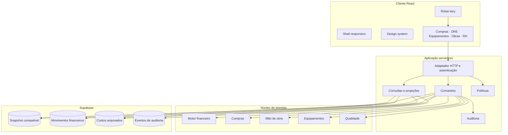
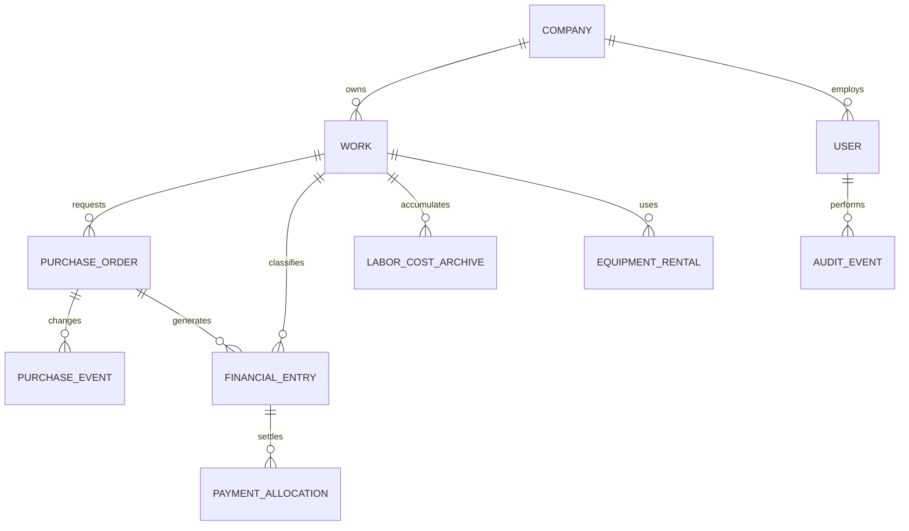
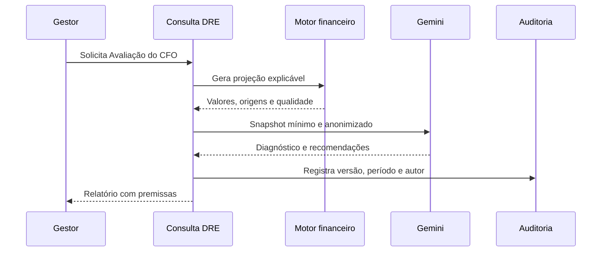
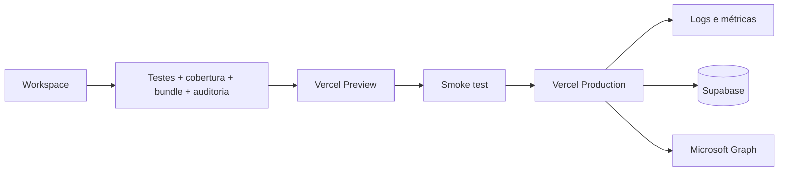

# Arquitetura do ARCD Construtech

Status: arquitetura-alvo para migração incremental  
Revisão: 23/07/2026

## Decisão executiva

O ARCD continuará nesta fase como um **monólito modular** implantado na Vercel. Microserviços, Kubernetes, filas e Redis aumentariam a operação sem resolver o gargalo atual: responsabilidades ainda concentradas no `LegacyApp.jsx` e dados empresariais persistidos como um documento amplo.

A evolução será interna e gradual:

1. rotas React carregadas sob demanda;
2. módulos por domínio com regras puras e interfaces públicas;
3. comandos de escrita autorizados no servidor;
4. projeções financeiras calculadas em uma única fonte;
5. migração seletiva das coleções críticas para tabelas relacionais;
6. auditoria e métricas antes de qualquer distribuição física.

## Contexto

O sistema administra obras, RH, ponto, folha, compras, fornecedores, financeiro, DRE, equipamentos, qualidade, documentos e análise por IA. A arquitetura precisa:

- impedir que arquivamento ou alteração de um módulo apague efeitos financeiros;
- aplicar permissões no servidor, não apenas esconder botões;
- reduzir o tamanho e o custo de alteração do `LegacyApp`;
- funcionar bem no celular e em redes instáveis;
- tornar cálculos financeiros reproduzíveis e auditáveis;
- manter implantação simples e reversível.

## Estado atual

```mermaid
flowchart LR
    U[Operador web/mobile] --> V[Vite + React]
    V --> L[LegacyApp e rotas lazy]
    V --> A[/api/* Vercel Functions]
    A --> AU[Autenticação e políticas]
    A --> DB[(Supabase)]
    A --> OD[OneDrive]
    A --> G[Gemini]
    A --> EXT[SINAPI, ORSE, CUB e clima]
    DB --> DOC[Documento empresarial compactado]
    DB --> ARQ[Quinzenas arquivadas]
```

Pontos fortes existentes:

- chave do Supabase somente no servidor;
- autenticação por e-mail/token e transição por PIN;
- gravação por seções com versão e merge de três vias;
- custos arquivados recompostos no servidor;
- políticas servidoras para Compras e Conferências;
- OneDrive restrito a workspaces conhecidos;
- planilhas e gráficos isolados em chunks;
- testes financeiros e de permissões.

Riscos atuais:

- `LegacyApp.jsx` reúne muitos domínios;
- o documento empresarial é uma unidade ampla de leitura e persistência;
- contratos de API ainda são implícitos;
- rate limiting em memória varia entre instâncias serverless;
- não há livro financeiro e auditoria imutável completos;
- cálculos importantes podem ser repetidos em telas diferentes;
- o bundle principal continua grande.

## Arquitetura-alvo



A regra é: **a interface solicita; o servidor autoriza; o domínio calcula; o repositório persiste**.

### Camadas

| Camada | Pode depender de | Não pode depender de |
|---|---|---|
| `app/` | páginas, componentes e API client | detalhes do Supabase |
| `features/` | `domains/`, UI e API client | import interno de outra feature |
| `domains/` | tipos e utilitários puros | React, navegador, banco e Gemini |
| `server/application/` | domínios, repositórios e políticas | componentes React |
| `server/infrastructure/` | SDKs e contratos externos | regras de apresentação |
| `api/` | adaptadores HTTP finos | cálculo financeiro duplicado |

### Estrutura desejada

```text
src/
  app/                  # shell, router, providers e error boundaries
  components/           # design system compartilhado
  features/
    compras/
    dre/
    equipamentos/
    obras/
    rh/
  domains/
    compras/
    financeiro/
    equipamentos/
    workforce/
  lib/                  # browser e exportações lazy
server/
  application/          # comandos, consultas e casos de uso
  domain/               # regras servidoras puras
  infrastructure/       # Supabase, OneDrive, Gemini e fontes
  policies/             # autorização por recurso
api/                    # adaptadores Vercel
```

Cada feature exporta somente sua página de rota e interface pública. Importações profundas entre features não são permitidas.

## Domínios e fontes de verdade

| Domínio | Agregados | Fonte de verdade |
|---|---|---|
| Obras | obra, contrato, orçamento, cronograma | cadastro da obra |
| RH | funcionário, lotação, presença, quinzena | ponto ativo + arquivo imutável |
| Compras | solicitação, cotação, pedido, recebimento | pedido e eventos |
| Financeiro | receita, despesa, pagamento, conciliação | livro de movimentos |
| DRE | projeção por competência/obra/empresa | livro, contratos e custos |
| Equipamentos | equipamento, locação, manutenção | cadastro e eventos de locação |
| Qualidade | conferência, achado, evidência, validação | conferência auditável |
| Documentos | workspace, pasta, arquivo | OneDrive + metadados do app |

O DRE nunca deve ser um total editável: é uma **projeção reproduzível**. O arquivamento do ponto remove detalhes do conjunto ativo, mas conserva resumo imutável por obra e competência.

## Contratos

Novos comandos usam envelope versionado e chave idempotente:

```json
{
  "version": 1,
  "command": "purchase.delete",
  "requestId": "uuid",
  "expectedVersion": "revisao",
  "payload": {
    "purchaseId": "PC-0002",
    "reason": "Pedido duplicado"
  }
}
```

```json
{
  "ok": true,
  "data": {},
  "meta": {
    "requestId": "uuid",
    "revision": "nova-revisao",
    "auditId": "uuid"
  }
}
```

Erros possuem código estável, mensagem e detalhes. Exclusões exigem motivo, autorização e registro de antes/depois. Quando existe consequência financeira, usa-se exclusão lógica.

Comandos prioritários:

- `attendance.archive` e `attendance.restore`;
- `purchase.create`, `update`, `delete` e `payment.allocate`;
- `financial.transaction.create`, `update` e `delete`;
- `equipment.rental.create`, `adjust` e `close`;
- `quality.finding.create`, `submitEvidence` e `approve`.

Consultas prioritárias:

- `dre.company(period)` e `dre.work(workId, period)`;
- `purchase.management(scope, filters)` e `purchase.history`;
- `equipment.financial(workId, period)`;
- `work.dashboard(workId)`.

Toda consulta financeira devolve total, composição e avisos de qualidade. Cada KPI deve abrir os lançamentos que o formam.

## Dados evolutivos

O snapshot atual será mantido durante a migração. Novas tabelas recebem `company_id`, `id`, `revision`, datas e autoria.



Ordem de extração:

1. `financial_entries` e `payment_allocations`;
2. `purchase_orders` e `purchase_events`;
3. `labor_cost_archives`;
4. `equipment_rentals`;
5. `audit_events`.

Cada migração usa leitura dupla temporária, reconciliação, troca da fonte de leitura e remoção posterior do campo antigo.

## Segurança

- Supabase Auth por e-mail é o caminho definitivo;
- PIN é apenas transição/dispositivo compartilhado;
- RBAC é combinado com escopo de obra;
- políticas são aplicadas no servidor por comando;
- IA recebe apenas o recorte autorizado;
- rate limiting distribuído substituirá os `Map` locais;
- OneDrive opera somente em workspaces registrados;
- segredos ficam na Vercel;
- ações financeiras e destrutivas são auditadas;
- tokens, PINs e dados pessoais não entram em logs.

## IA gerencial

O Gemini não calcula totais nem é fonte de verdade:



A IA não altera dados nem executa pagamentos.

## Resiliência e observabilidade

- escritas usam revisão esperada ou idempotência;
- retries somente em operações idempotentes;
- integrações externas possuem timeout e fallback;
- uma falha da IA, CUB ou notícias não bloqueia a operação;
- arquivos de ponto são imutáveis e restauráveis;
- logs levam `requestId`, empresa, usuário, comando, recurso e resultado;
- métricas cobrem login, carga, gravação, conflitos, tamanho do snapshot, divergência do DRE, arquivamentos, IA, bundle e build.

## Implantação



Gates:

- testes financeiros e de permissão;
- nenhuma vulnerabilidade alta;
- `git diff --check`;
- build Vite;
- orçamento de bundle;
- smoke test das rotas alteradas;
- migração com rollback.

## Plano incremental

### Fase 1 — interface

- criar router e páginas lazy em `features/`;
- retirar Compras, DRE e Equipamentos do `LegacyApp`;
- consolidar layout, modal, tabela responsiva e formulários.

### Fase 2 — aplicação

- introduzir comandos e consultas versionados;
- mover DRE para um único motor;
- centralizar autenticação, erros e rate limiting.

### Fase 3 — livro financeiro

- criar movimentos e alocações;
- executar backfill e reconciliação;
- fazer o DRE ler do livro e custos arquivados.

### Fase 4 — auditoria e compras

- eventos imutáveis para criação, ajuste, pagamento e exclusão;
- migrar pedidos e histórico.

### Fase 5 — operação

- rate limiting distribuído;
- telemetria, alertas e SLOs;
- revisar serviços separados apenas com métricas reais.

## Critérios de conclusão

- Compras, DRE e Equipamentos não vivem no `LegacyApp`;
- todo total financeiro possui função única, teste e detalhamento;
- permissões críticas têm testes de integração no servidor;
- arquivar/restaurar ponto conserva o mesmo custo no DRE;
- exclusões financeiras deixam auditoria;
- nenhum endpoint sensível funciona sem autenticação;
- o app não estoura horizontalmente no celular;
- gráficos, Excel, PDF e IA não entram no bundle inicial;
- contratos e documentação acompanham mudanças.

Microserviços, Kubernetes, filas, Redis e app móvel nativo só serão avaliados quando métricas demonstrarem necessidade real.

